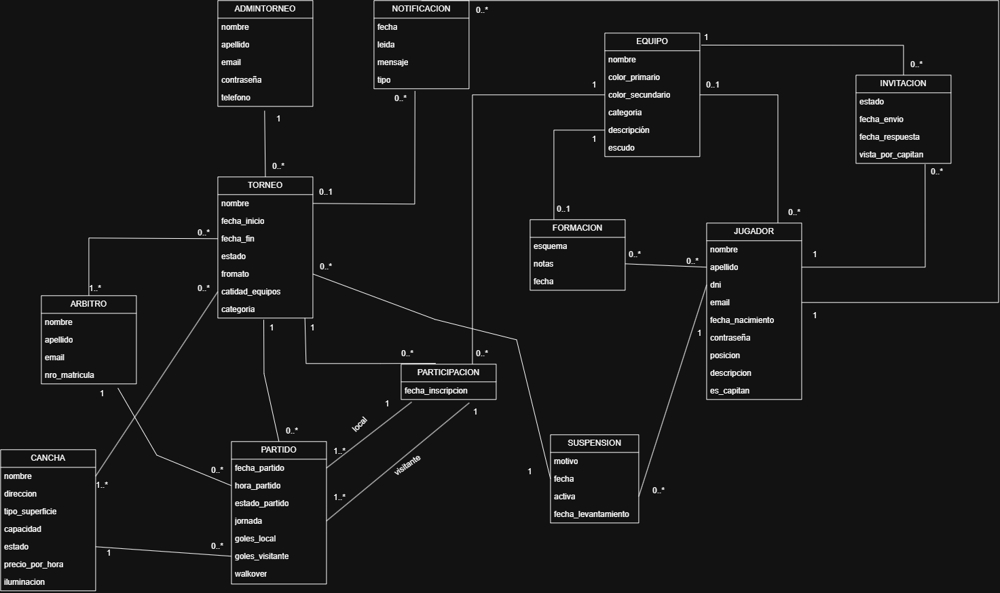

# Propuesta TP DSW

## Grupo
### Integrantes
* 52995 - Tomás, Andino
* 52978 - Burgos, Mateo
* 52991 - Negri Cacurri, Geronimo

### Repositorios
* [frontend app](https://github.com/tomasandino12/frontend-TPtorneos)
* [backend app](https://github.com/tomasandino12/backend-TPtorneos)

## Tema
### Descripción
El proyecto consiste en una aplicación web para la gestión administrativa de torneos de fútbol amateur. Cuenta con dos menús principales: uno destinado a los administradores de los torneos, quienes pueden crear y gestionar torneos, canchas, árbitros y jugadores participantes; y otro destinado a los jugadores, quienes pueden registrarse, crear su propio equipo, administrarlo incorporando jugadores registrados en la aplicación y definir estrategias para sus próximos partidos.

La aplicación genera automáticamente los fixtures de cada torneo, permite a los administradores cargar los resultados de los partidos disputados y muestra la tabla de posiciones actualizada en tiempo real. Está pensada para clubes, grupos de amigos o ligas barriales que deseen organizar sus competencias de forma simple y ordenada.

### Modelo
![modelo de dominio ] 

## Alcance Funcional 

### Alcance Mínimo
Regularidad:
|Req|Detalle|
|:-|:-|
|CRUD simple|1. CRUD Jugador 2. CRUD Cancha 3. CRUD Arbitro|
|CRUD dependiente|1. CRUD Partido {depende de} CRUD Torneo, CRUD Equipo, CRUD Arbitro, CRUD Cancha 2. CRUD Equipo {depende de} CRUD Jugador|
|Listado + detalle| 1. Listado de equipos filtrados por sus puntos y partidos jugados, muestra posición, nombreEquipo, puntos, partidos jugados empatados ganados y perdidos y diferencia de gol  => detalle muestra datos del equipo como sus jugadores y historial de partidos  2. Listado de partidos filtrados por jornada  => detalle muestra equipos, cancha, arbitro, fecha y horario|
|CUU/Epic|1. Ver jugadores sin equipo y poder agregarlos (a través de un sístema de invitación). 2. Crear un equipo y también posibilidad  de salir del mismo.|

Adicionales para Aprobación
|Req|Detalle|
|:-|:-|
|CRUD |1. CRUD Jugador 2. CRUD Cancha 3. CRUD Arbitro 4. CRUD Equipo 5. CRUD Torneo 6. CRUD Partido 7. CRUD Suspensión|
|CUU/Epic|1. Crear un torneo, agregando a los equipos (de una misma categoría) y cargar resultados de los encuentros 2. Crear estrategias de equipo (asignar una posición a cada jugador) 3. Aplicar sanción a un jugador (fecha y motivo), quedando el jugador suspendido para próximos partidos|

### Alcance Adicional Voluntario

*Nota*: El Alcance Adicional Voluntario es opcional, pero ayuda a que la funcionalidad del sistema esté completa y será considerado en la nota en función de su complejidad y esfuerzo.

|Req|Detalle|
|:-|:-|
|Listados |1. Tabla de posiciones en vivo del torneo 2. Jugadores por equipo del torneo (con detalle de cada jugador)|
|CUU/Epic|1. Asignar/transferir capitanía a otro miembro del equipo 2. Cargar escudo de equipo (.jpg) 3. Editar el fixture de un torneo (fecha, horario, arbitro o cancha)|
|Otros|1. Gestión de árbitros, jugadores y canchas|
